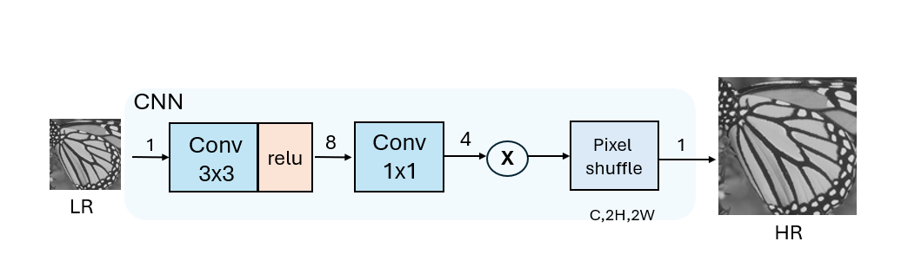
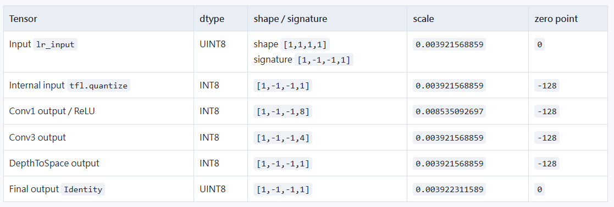

# SR Core Lite

SR Core Lite 是一個最小功能的 Super Resolution RTL 設計紀錄，包含 Verilog RTL、系統層 wrapper、TFLite 量化參數轉換工具、Vivado BRAM/ROM 流程，以及可線上瀏覽的 HTML handoff 文件。

## 線上瀏覽

- [SR Core HTML 首頁](https://ssparkoao.github.io/sr_core_lite/html/)
- [GitHub / Pages / push 學習筆記](https://ssparkoao.github.io/sr_core_lite/learning/github-pages-git/)
- [模型分析頁](https://ssparkoao.github.io/sr_core_lite/html/model_analysis.html)

## 模型概覽



`model.png` 是 SR Core 小模型的架構視覺圖，用來快速理解資料流與主要運算區塊。



`model_spec.png` 補充模型規格與設計重點，適合和 HTML 文件一起對照閱讀。

## 主要資料夾

- `RTL/`：已驗證的核心 RTL module 與 testbench。
- `RTL_sys/`：系統層 wrapper、Phase8 記憶體架構與 Vivado BRAM/ROM 相關設計。
- `tools/`：TFLite 參數解析、golden model、Vivado hex/coe 轉換工具。
- `generated/`、`generated_vivado_hex/`：模型參數、golden data 與硬體用記憶體資料。
- `html/`：GitHub Pages 發布用 HTML 文件。
- `learning/`：學習 Git、GitHub、GitHub Pages 的教學筆記。
- `handoff/`：專案交接紀錄。

## 更新到 GitHub

穩定完成一個階段後再更新，不需要每改一點就 push。

```powershell
cd C:\M11413047\codex\final_proj\model_lite\sr_core
git status
git add .
git commit -m "Describe the stable update"
git push
```

簡單記法：

```text
add    = 選檔案
commit = 本機存檔點
push   = 上傳 GitHub
Pages  = GitHub 把 HTML 變網站
```
